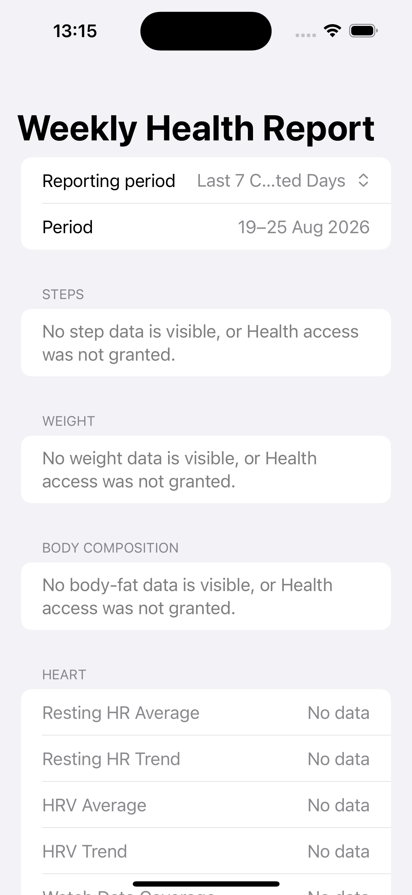

# Weekly Health Report

[](https://github.com/syamaner/WeeklyHealthReport/actions/workflows/ios-ci.yml)

Weekly Health Report is a small iPhone app that turns selected Apple Health data into a readable weekly summary. Pick a reporting period, refresh the data, then copy the plain-text report wherever you need it.

It is a personal informational utility, not medical software.



The screenshot uses invented data. The repository does not contain exported or personal HealthKit values.

## What it reports

| Area | Included measurements |
| --- | --- |
| Body | Latest weight and recording time, weight trend, body fat and trend, waist circumference and four-week trend |
| Daily activity | Average daily steps, active energy, Apple Exercise Time, workout count, type, duration and start time |
| Heart and sleep | Resting heart rate, HRV, sleep and days with Apple Watch data |
| Fitness estimates | Latest VO₂ max with four-week, three-month and six-month averages, plus blood oxygen |
| Glucose | A weekly average calculated from daily values, observed range and days with data |
| Medications | Taken medication events, dose and time on iOS 26 or later |

The app has one main screen and a separate Developer Diagnostics screen for checking daily values against Apple Health. **Copy Report** puts a human-readable version on the iOS clipboard.

## Privacy

All HealthKit reading and calculation happens on the iPhone. The app has:

- no accounts or authentication
- no analytics or telemetry
- no backend, database or cloud storage
- no background sync
- no network service or remote transport

Nothing leaves the device unless you tap **Copy Report** and paste it somewhere yourself.

The app asks only for read access to the HealthKit types it uses. HealthKit does not tell an app whether read access was denied, so a successful query with no visible samples is shown as **No data**, not zero.

<details>
<summary>See the requested Health permissions</summary>

The app requests read access to Body Mass, Body Fat Percentage, Waist Circumference, Blood Glucose, VO₂ Max, Oxygen Saturation, Step Count, Heart Rate, Resting Heart Rate, Heart Rate Variability (SDNN), Sleep Analysis, Active Energy, Apple Exercise Time and Workouts. On iOS 26 or later, it can also request access to medications that you select individually.

It never asks for write access, background delivery or clinical health records. If you installed an older build before a metric was added, iOS should offer the new read permission the next time the app runs.

</details>

Glucose is read from Apple Health. The app does not connect directly to Abbott, Lingo or another sensor account. The sensor's own app must write `bloodGlucose` samples to HealthKit first.

## Run it on your iPhone

You need a Mac with the current stable Xcode, an iPhone and an Apple development team for code signing. The deployment target is iOS 17. Medication reporting requires iOS 26 or later.

1. Clone the repository and open `WeeklyHealthReport.xcodeproj` in Xcode.
2. Copy `Config/Signing.local.xcconfig.example` to `Config/Signing.local.xcconfig`.
3. In the local file, replace `YOUR_TEAM_ID` with your Apple development team ID and choose a bundle identifier that is unique to your team.
4. Select the **WeeklyHealthReport** target and open **Signing & Capabilities**. Confirm that your team, bundle identifier and the **HealthKit** capability are present.
5. Connect and trust your iPhone. Enable Developer Mode if iOS asks for it.
6. Select the iPhone as the run destination and press Run.
7. Approve the Health read permissions you want the app to use.

`Config/Signing.local.xcconfig` is ignored by Git, so your personal signing values stay local. No App Store setup is required.

On iOS 26 or later, Health presents a separate medication chooser. To change access later, open Health, tap your profile picture, then go to **Apps > WeeklyHealthReport**. When you add a new medication in Health, enable WeeklyHealthReport on the final screen if you want the app to read it.

## Choose a reporting period

All dates use the iPhone's local calendar and time zone. The start is included and the end is excluded.

- **Last 7 Completed Days** is the default. It runs from local midnight seven calendar days ago to local midnight today.
- **Current Week** runs from the locale-aware start of this week to local midnight today. It excludes today's partial data.
- **Previous Week** is the previous complete locale-aware calendar week.

These are calendar periods, not a rolling 168-hour window. Last 7 Completed Days still contains seven calendar days when daylight-saving time changes.

## What gets copied

The copied report is plain text. Latest weight and waist are selected independently of the weekly period, so a measurement recorded today can appear alongside a report of completed days.

<details>
<summary>See a synthetic copied report</summary>

```text
Weekly Health Report
3–9 Feb 2025
Generated: 10 Feb 2025 at 09:41

Latest Weight: 72.4 kg
Weight Recorded: 10 Feb 2025 at 09:11
Weight 7-day Avg: 72.6 kg
Weight Trend: -0.5 kg vs previous 7d
Body Fat: 18.2%
Body Fat 28-day Avg: 18.7%
Body Fat Trend: -0.6 pp vs previous 28d
Waist Circumference: 84.7 cm
Waist Recorded: 8 Feb 2025 at 08:15
Waist 4-week Trend: -1.8 cm vs ~4 weeks earlier
Glucose Daily Average: 5.7 mmol/L
Glucose Observed Range: 3.9–8.6 mmol/L
Glucose Data Coverage: 7 / 7 days
Latest VO₂ Max: 32.1 mL/kg/min (9 Feb 2025 at 08:42)
VO₂ Max — 4 Weeks: 31.8 mL/kg/min (8 days)
VO₂ Max — 3 Months: 30.9 mL/kg/min (24 days)
VO₂ Max — 6 Months: 29.7 mL/kg/min (51 days)
Latest Blood Oxygen: 97% (10 Feb 2025 at 07:21)
Typical Blood Oxygen: 97%
Blood Oxygen Daily Range: 96–98%
Blood Oxygen Data Coverage: 7 / 7 days
Average Daily Steps: 8,432
Resting HR Average: 61 bpm
Resting HR Trend: -2.0 bpm vs previous 7d
HRV Average: 58 ms
HRV Trend: +4.0 ms vs previous 7d
Watch Data Coverage: 6 / 7 days
Average Sleep: 7h 32m
Active Energy: 3,456 kcal
Exercise: 143 min
Workouts: 2
Workout: Cycling — 42m — 05/02/2025 - 18:12
Workout: Yoga — 36m — 08/02/2025 - 09:05
Medication Taken: ExampleMed 20 mg — 1 dose at 9 Feb 2025 at 08:30; 1 taken event
```

</details>

## How the calculations work

Correct HealthKit aggregation is the main reason this project exists. Cumulative measurements use HealthKit statistics rather than manually adding raw samples from an iPhone, Apple Watch and other sources. Measurements such as HRV are calculated per day first so that a day with more samples does not dominate the week.

<details>
<summary>Read the metric-by-metric rules</summary>

- **Weight:** the latest visible body-mass sample in the preceding 30 days is shown independently. For trend, multiple readings on a day are averaged first; the mean of sampled days in the latest seven completed days is compared with the preceding seven completed days. Each side requires at least three sampled days. The signed difference is reported in kg.
- **Body fat:** HealthKit percent values are fractional (`0.30` means `30.0%`) and are converted to percentage points at the query boundary. Up to 60 days of visible samples are read. Multiple readings on one calendar day are averaged first, then sampled days receive equal weight. Seven-day and current or previous 28-day averages require at least two sampled days. Trend is the current 28-day daily mean minus the previous 28-day daily mean, in percentage points.
- **Waist circumference:** the latest visible manual measurement from an eight-week lookback ending at refresh time is displayed in centimetres with its timestamp, independently of the selected weekly period. Sparse measurements are not averaged. For a four-week trend, the app compares it with the visible sample closest to 28 days earlier, but only when that sample is 21 to 35 days older. Otherwise it reports insufficient history. A measurement entered today can appear immediately.
- **Blood glucose:** HealthKit's daily `discreteAverage`, `discreteMin` and `discreteMax` statistics are calculated for each complete local calendar day. Values are converted using HealthKit's blood-glucose molar mass and displayed in mmol/L. The weekly average is the arithmetic mean of valid daily averages, so days with more sensor readings do not dominate. The observed range is the minimum and maximum visible statistic across the period, and coverage reports days with data. The app does not apply a target range, time-in-range score, diagnosis or medical interpretation.
- **VO₂ max:** the latest visible estimate and timestamp from the preceding six calendar months are displayed. Multiple estimates on one local calendar day are averaged first, then sampled days receive equal weight in rolling four-week, three-month and six-month averages ending at refresh time. Each average requires at least three sampled days and reports its sampled-day count. VO₂ max is a discrete Watch estimate, not a clinical exercise test. The app does not classify fitness or provide medical interpretation.
- **Blood oxygen:** the latest visible oxygen-saturation sample from a 30-day lookback is displayed with its timestamp. For the selected completed-day period, visible discrete samples are converted from HealthKit fractions to percentage points. The median is calculated within each complete day, followed by the median and range of valid daily medians. This prevents days with more background measurements from dominating and reduces the effect of isolated outliers. Coverage reports valid days. Apple Watch blood-oxygen values are general wellness estimates, not medical measurements.
- **Steps:** a local-calendar-day `HKStatisticsCollectionQueryDescriptor` uses `cumulativeSum`. HealthKit resolves contributing sources; the app never manually sums raw iPhone and Watch samples. The weekly average is the sum of daily totals divided by every complete reporting day, normally seven.
- **Resting heart rate:** the app obtains one HealthKit `discreteAverage` statistic for each complete calendar day, then calculates the arithmetic mean of valid daily values. Days without a visible value are omitted and days with more samples receive no extra weight. The selected period is compared with the immediately preceding period containing the same number of complete days. A signed bpm trend requires at least three valid days on each side.
- **HRV:** the app uses the same daily-first and equivalent-period comparison with `heartRateVariabilitySDNN`, converted to milliseconds. A signed trend requires at least three valid days on each side. HRV is not presented as a readiness score or medical interpretation.
- **Apple Watch coverage:** coverage is the number of complete reporting days containing at least one heart-rate sample whose HealthKit device metadata identifies an Apple Watch. It shows evidence of Watch data on a day, not continuous wear time. An empty query is shown as **No data** because it may also mean heart-rate read access was denied.
- **Apple Exercise Time:** one HealthKit `cumulativeSum` statistic covers the exact report interval and is converted to minutes. Raw samples are not summed manually.
- **Active energy:** one HealthKit `cumulativeSum` statistic covers the exact report interval and is converted to kcal. This is an activity measurement, not total energy expenditure.
- **Workouts:** the app reads `HKWorkout` samples whose start date is inside the report interval. It shows the count, summed duration, activity type, duration and local start time in `dd/MM/yyyy - HH:mm` format. Functional Strength Training is shortened to `FST`. A workout crossing midnight belongs to the day on which it started. An empty result is shown as **No data** because HealthKit does not distinguish missing read access from an empty history.
- **Sleep:** only `asleepUnspecified`, `asleepCore`, `asleepDeep` and `asleepREM` samples are included. `awake` and `inBed` are excluded. Included intervals from all sources are clipped and combined so overlaps count once. Each report date is a local noon-to-noon night bucket ending on that wake date. Only nights with visible asleep time enter the average.
- **Medications on iOS 26 or later:** the person chooses individual medications through Apple's medication access sheet. The app queries active and archived authorised concepts, then includes only `HKMedicationDoseEvent` samples with a `taken` status and a start time inside the selected completed-day period. Events are grouped by HealthKit's exact medication concept, so a changed strength appears as a separate row. Each row reports the latest logged quantity and time plus the number of taken events. Diagnostics lists every event. Medications without a visible taken event are omitted from copied text. Missing events are never treated as a missed dose or non-adherence.

Apple does not fully document the sleep source precedence used by the Health app. Combining overlapping asleep intervals is the closest transparent and defensible calculation available through documented HealthKit data.

</details>

## Check the results against Apple Health

Daily Steps totals have been compared successfully with Apple Health on a real iPhone. A one-step difference can still appear in the final average when two interfaces round the same daily inputs differently.

For your own check, run a Debug build, select **Last 7 Completed Days**, and use the same dates and local time zone in both apps. Open **Developer Diagnostics** at the bottom of the report screen to see daily values and exact totals.

<details>
<summary>See the complete validation checklist</summary>

1. **Steps:** compare every daily diagnostic value, then calculate the seven-day average from those values.
2. **Weight:** compare the current and previous seven-day daily values. Today's partial day is excluded from averages, but the independent latest measurement can still be today.
3. **Waist:** compare the latest measurement and timestamp with Health's Waist Circumference detail. For trend, confirm that Diagnostics selected the closest sample to 28 days earlier and that it is 21 to 35 days older than the latest sample.
4. **Blood glucose:** first confirm that the sensor's samples appear in Health. Compare each daily diagnostic average and range with Health for the same complete day, then average the valid daily averages. Allow for vendor-to-Health synchronisation delay.
5. **VO₂ max:** compare every raw diagnostic estimate and timestamp with Health's Cardio Fitness data. Recalculate the daily means, then compare the four-week, three-month and six-month windows. Confirm the sampled-day count before comparing rounded averages.
6. **Blood oxygen:** compare each raw diagnostic value with Health, then independently calculate each completed day's median. Compare the median and range of those daily medians, not Health's raw-sample average or range. The latest value can be from today even though the period summary excludes today.
7. **Resting heart rate and HRV:** compare each valid day's diagnostic value with Health's daily view for the selected and immediately preceding equivalent periods. Average only the valid days.
8. **Active energy and exercise:** compare the exact unrounded diagnostic totals over the selected dates before comparing rounded display values.
9. **Workouts:** compare workout start dates, count and total duration.
10. **Sleep:** compare each diagnostic night with the Health date on which you woke. If a night differs, check for overlapping third-party or manually entered records.
11. **Medications:** compare every taken-event timestamp in Diagnostics with Health. Confirm that an unlogged medicine is absent and a changed strength appears as a separate row. Today's event enters the default report only after that day is complete.
12. Tap **Copy Report**, paste it into Notes, and compare it with the screen. Diagnostics are never included in copied text.

</details>

Simulator tests cover calendar boundaries, daily-first averages, missing data, sleep overlap handling, workout totals, formatting and clipboard output. A simulator cannot provide representative personal HealthKit data, so final validation still requires an iPhone.

Values can legitimately differ while Health or a sensor app is still synchronising, when historical read access is limited, when the selected dates differ, or because Apple has not documented part of its source precedence. Investigate material discrepancies through the daily and nightly diagnostics rather than hiding them through rounding.

Glucose and other health values are informational. This app must not be used to make treatment decisions.

## Development notes

[DEVELOPMENT_NOTES.md](DEVELOPMENT_NOTES.md) records the Codex-assisted development experiment and its bounded token and API-equivalent cost estimates.

## Licence

Licensed under the [MIT License](LICENSE).
