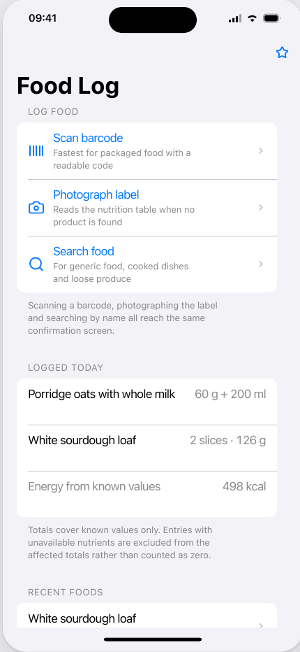
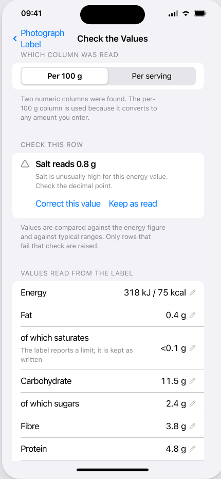
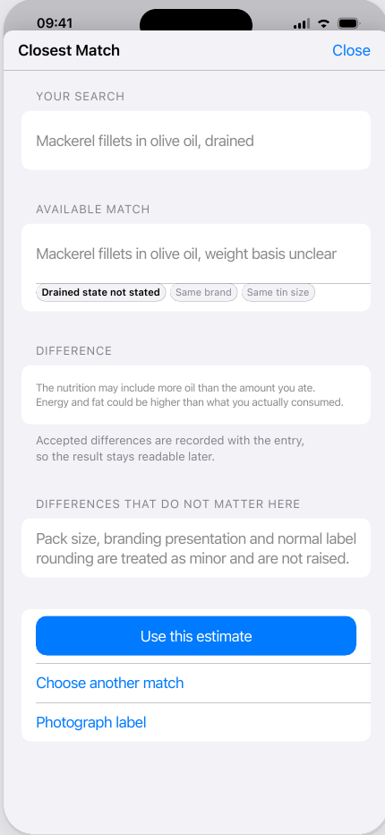
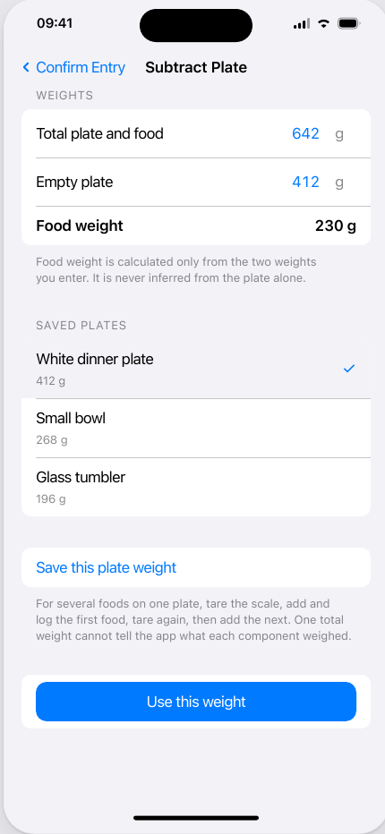

# Food log UX design baseline

Status: **accepted planning baseline — implementation not started**

Design artefacts:

- [interactive HTML bundle](designs/food-log-all-screens.html)
- [two-page PDF contact sheet](designs/food-log-all-screens.pdf)

HTML SHA-256:
`7d8ed9c96def616367ebbdb4f565324347f7c8cbf48aef8c18f253a601ad4201`

PDF SHA-256:
`5de647bccc047d8d5b812c6bde68c398b8ad65aa5fa8a0cc7d7e3b4b9927f40a`

This document records how the supplied 36-screen design bundle changes the food
logging plan. The HTML is the interaction and visual baseline. It is not production
code, implementation evidence, source-selection authority or permission to use a
camera, provider, Drive account or HealthKit store. Its product names, barcodes and
nutrition values are invented fixtures.

## Representative renders

The PDF contact sheet is the complete non-interactive visual reference. These
native-resolution crops make the most important flows directly reviewable in the
repository.

### Entry routes

### OCR review

### Closest-match decision

### Plate subtraction

## Accepted interaction contract

The normal path must not require a user to construct a nutrition profile in a blank
manual-entry form. Every new entry starts from one of three routes:

1. scan a barcode, search and populate;
2. photograph a nutrition label, extract and populate; or
3. enter a generic food name, search and populate.

All three routes converge on the same confirmation screen. The user may choose the
closest match, change quantity or units, select the preparation state, account for
plate/container weight, inspect the nutrition source and override an incorrect
populated result. An override is a correction to evidence or a proposed result, not
the default capture workflow.

If a barcode lookup fails, the primary fallback is label photography. If a search
has no defensible result, the interface offers label photography or another search;
it does not turn into a blank nutrient table.

## Match and uncertainty behaviour

The design intentionally permits the user to accept a closest match. Minor
differences such as pack size, branding presentation and ordinary label rounding do
not need to interrupt the flow. The accepted choice and source still remain
versioned.

Material differences must be raised before save:

- raw, cooked and named preparation states;
- bone and skin state;
- drained state and edible quantity;
- oil, brine, water, sauce or another packing medium;
- fortified versus unfortified formulation;
- serving, per-unit, per-100 g and per-100 ml bases; and
- materially different formulation or fat level.

The user may deliberately keep the closest result, but it remains an estimate and
cannot be presented as exact package nutrition. This preserves the accepted
`measured`, `augmented`, `bounded` and `unknown` contract while allowing a practical
"good enough" interaction.

## Quantity, preparation and plate handling

The shared confirmation flow supports grams, millilitres, counts and evidenced
product-specific units such as slices or servings. It shows the conversion used and
does not invent an unstated unit weight.

Raw and cooked records are searched and selected as different food states, not
silently converted. Changing preparation re-filters the candidates or makes the
mismatch explicit.

Plate/container handling has four user-visible modes:

- food only, for a tared scale or separately weighed food;
- subtract plate, using total and empty weights;
- saved plate, using a previously confirmed container weight; and
- estimate by a supported portion or unit.

For multiple foods on one plate, the intended route is incremental weighing and
logging. One total plate weight must not be used to invent component weights.

## Screen inventory

The bundle freezes the following design coverage:

- food-log home and capture-method chooser;
- barcode scanner, permission denial, search, exact result, closest result, miss
  and damaged-code states;
- label guidance, crop/quality review, blur warning, OCR progress, uncertain-row
  review and OCR correction;
- recent/saved search, raw/cooked results and no-result state;
- exact, closest and generic confirmation states;
- closest-match comparison;
- quantity/unit selection, including an unsupported unit weight;
- preparation selection;
- weighing-mode selection, saved-plate selection, plate subtraction and saved-plate
  management;
- nutrition source/detail and adjust/override sheets;
- save success, saved/recent foods, offline saved-food reuse; and
- representative light and dark appearances.

The design uses existing WeeklyHealthReport conventions: native iOS grouped forms,
system typography, standard navigation and sheets, 44-point controls, Dynamic Type,
VoiceOver-compatible labelling and state communication that does not rely on colour
alone.

## Planning consequences

The earlier manual-first MVP is superseded. In particular, manual nutrition-panel
entry is not an acceptable primary or fallback journey.

The issue graph must be re-triaged before implementation:

- #90 must preserve OCR/search candidates, source evidence, user selections,
  overrides, quantity conversions and saved-plate versions in the local protocol.
- #88 and #92 are now MVP-critical evidence gates rather than optional polish.
- #93 is required to deliver the label-photography route represented in the design.
- #98 or a newly decomposed bounded search/population slice is required to deliver
  generic search and closest-match population without silently widening automatic
  adjudication.
- #94 remains a phase container and must be decomposed around the shared capture,
  confirmation, quantity and reuse shell shown here.
- #87 still prevents Open Food Facts from being treated as a dependable Phase 1
  identity or nutrition source. Barcode lookup therefore needs a separately
  accepted source/fallback plan; a miss routes to label photography.
- Commercial/provider evaluation remains separately authorised. The designs do not
  select or permit a provider.

## Implementation acceptance baseline

An implementation derived from these designs must demonstrate that:

- all three entry routes reach the shared confirmation model;
- barcode misses and weak matches have an explicit label-photo fallback;
- OCR uncertainty and corrections are visible and versioned;
- closest-match differences are explained before acceptance;
- raw/cooked state and quantity basis cannot drift silently;
- plate subtraction is reproducible from its inputs;
- bounds and unknowns survive display, calculation and export;
- populated values expose their source without overwhelming the primary flow;
- saved-food reuse works offline; and
- accessibility, error, permission and dark-mode states remain coherent in the
  production SwiftUI implementation.

Native implementation may adjust spacing or component composition for platform and
accessibility behaviour. It must not remove one of the three capture routes, replace
the shared confirmation model with a blank nutrient form, or hide a material match
difference without a separately ratified product decision.
